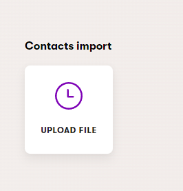

# Xperience by Kentico Contacts Importer

[](https://github.com/Kentico/.github/blob/main/SUPPORT.md#labs-limited-support)

[](https://github.com/Kentico/xperience-by-kentico-contacts-importer/actions/workflows/ci.yml)

[](https://www.nuget.org/packages/Kentico.Xperience.Contacts.Importer)

## About The Project

Enables bulk importing of Contacts into an Xperience by Kentico solution using a `.csv` file.


## Getting Started

### Prerequisites

- Xperience by Kentico >= 30.5.1

  - <https://docs.kentico.com/documentation/changelog#hotfix-may-22-2025> 

### Installation

Add the package to your application using the .NET CLI

```powershell
dotnet add package Kentico.Xperience.Contacts.Importer
```

### Add to your application dependencies

```csharp
builder.Services.AddKentico();
// ... other registrations
services.AddContactsImport();
```

### Add to your middleware pipeline

```csharp
app.InitKentico();
// ... other registrations
app.UseContactsImport();
```

## Usage

1. open contact importer application <br>
   
1. select file
1. select mode
   1. Delete - this mode will delete contact by ContactGUID (CSV shall contain column with ContactGUID header)
   1. Insert (skip existing) - this mode will import contacts (CSV shall contain column with ContactGUID)
1. "Assign to contact group" - all contact (existing included) will be assigned to specified group
1. Delimiter - delimiter used for CSV (common are `;`, `,`, `\\t`, ..)
1. "Batch size" - size of batch used for database operation, for instances with limited resources this value should not exeed 5000, lower than 100 is not reccomended.
1. Click "Send file" button

> Depends on resources available to application, but degraded application performance is expected during import.

Notes:

- do not close window with progress, file is uploaded from that window.
- do not manipulate file during import, close all applications write access to file (or lock)

### Supported CSV columns

| Column            | .NET Type | Required |
| ----------------- | --------- | -------- |
| ContactGUID       | Guid      | yes      |
| ContactCreated    | DateTime  | yes      |
| ContactFirstName  | string    | no       |
| ContactLastName   | string    | no       |
| ContactEmail      | string    | no       |
| ContactAddress1	| string	| no	   |
| ContactMiddleName | string    | no       |

In the CSV file, define the first row as a header containing the names of the individual columns.
Header validation is performed during the file upload. See example file [Contact Sample](https://github.com/Kentico/xperience-by-kentico-contacts-importer/blob/main/data/contact_sample.csv).

> [!IMPORTANT]  
> For correct functionality, please make sure to add a newline at the end of the CSV file.

## Contributing

To see the guidelines for Contributing to Kentico open source software, please see [Kentico's `CONTRIBUTING.md`](https://github.com/Kentico/.github/blob/main/CONTRIBUTING.md) for more information and follow the [Kentico's `CODE_OF_CONDUCT`](https://github.com/Kentico/.github/blob/main/CODE_OF_CONDUCT.md).

Instructions and technical details for contributing to **this** project can be found in [Contributing Setup](./docs/Contributing-Setup.md).

## License

Distributed under the MIT License. See [`LICENSE.md`](./LICENSE.md) for more information.

## Support

[](https://github.com/Kentico/.github/blob/main/SUPPORT.md#labs-limited-support)

This project has **Kentico Labs limited support**.

See [`SUPPORT.md`](https://github.com/Kentico/.github/blob/main/SUPPORT.md#full-support) for more information.

For any security issues see [`SECURITY.md`](https://github.com/Kentico/.github/blob/main/SECURITY.md).
