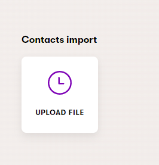

[![Contributors][contributors-shield]][contributors-url]
[![Forks][forks-shield]][forks-url]
[![Stargazers][stars-shield]][stars-url]
[![Issues][issues-shield]][issues-url]
[![MIT License][license-shield]][license-url]
[![Discord][discussion-shield]][discussion-url]


<!-- ABOUT THE PROJECT -->
## About The Project

Please put here some general information about your Intergration / App / Solution.


<!-- GETTING STARTED -->
## Getting Started

This is an example of how you may give instructions on setting up your project locally.
To get a local copy up and running follow these simple example steps.

### Prerequisites

This is an example of how to list things you need to use the software and how to install them.
* npm
  ```sh
  npm install npm@latest -g
  ```

### Installation

### Register Contacts importer to you dependency injection container
```csharp
builder.Services.AddKentico();
// ... other registrations
services.AddContactsImport();
```

### Register Contacts importer to your application
```csharp
app.InitKentico();
// ... other registrations
app.AddContactsImport();
```


<!-- USAGE EXAMPLES -->
## Usage

1) open contact importer application <br>
 
3) select file
4) select mode 
   1) Delete - this mode will delete contact by ContactGUID (CSV shall contain column with ContactGUID header)
   2) Insert (skip existing) - this mode will import contacts (CSV shall contain column with ContactGUID)
5) "Assign to contact group" - all contact (existing included) will be assigned to specified group
6) Delimiter - delimiter used for CSV (common are `;`, `,`, `\\t`, ..)
7) "Batch size" - size of batch used for database operation, for instances with limited resources this value should not exeed 5000, lower than 100 is not reccomended.
8) Click  "Send file" button

> Depends on resources available to application, but degraded application performance is expected during import.

Notes:
- do not close window with progress, file is uploaded from that window.
- do not manipulate file during import, close all applications write access to file (or lock)


### Supported columns

|Column|.NET Type|Required|
|---|---|---|
|ContactGUID|Guid|yes|
|ContactCreated|DateTime|yes|
|ContactFirstName|string|no|
|ContactLastName|string|no|
|ContactEmail|string|no|
|ContactAge|Int32|no|
|ContactMiddleName|string|no|

<!-- CONTRIBUTING -->
## Contributing

For Contributing please see  <a href="./CONTRIBUTING.md">`CONTRIBUTING.md`</a> for more information.


<!-- LICENSE -->
## License

Distributed under the MIT License. See [`LICENSE.md`](./LICENSE.md) for more information.


<!-- MARKDOWN LINKS & IMAGES -->
<!-- https://github.com/Kentico/Home/wiki/Checklist-for-publishing-a-new-OS-project#badges-->
[contributors-shield]: https://img.shields.io/github/contributors/Kentico/kontent-custom-element-samples.svg?style=for-the-badge
[contributors-url]: https://github.com/Kentico/repo-template/graphs/contributors
[forks-shield]: https://img.shields.io/github/forks/Kentico/kontent-custom-element-samples.svg?style=for-the-badge
[forks-url]: https://github.com/Kentico/repo-template/network/members
[stars-shield]: https://img.shields.io/github/stars/Kentico/kontent-custom-element-samples.svg?style=for-the-badge
[stars-url]: https://github.com/Kentico/repo-template/stargazers
[issues-shield]: https://img.shields.io/github/issues/Kentico/kontent-custom-element-samples.svg?style=for-the-badge
[issues-url]:https://github.com/Kentico/repo-template/issues
[license-shield]: https://img.shields.io/github/license/Kentico/kontent-custom-element-samples.svg?style=for-the-badge
[license-url]:https://github.com/Kentico/repo-template/blob/master/LICENSE.md
[discussion-shield]: https://img.shields.io/discord/821885171984891914?color=%237289DA&label=Kontent%20Discord&logo=discord
[discussion-url]: https://discord.com/invite/SKCxwPtevJ